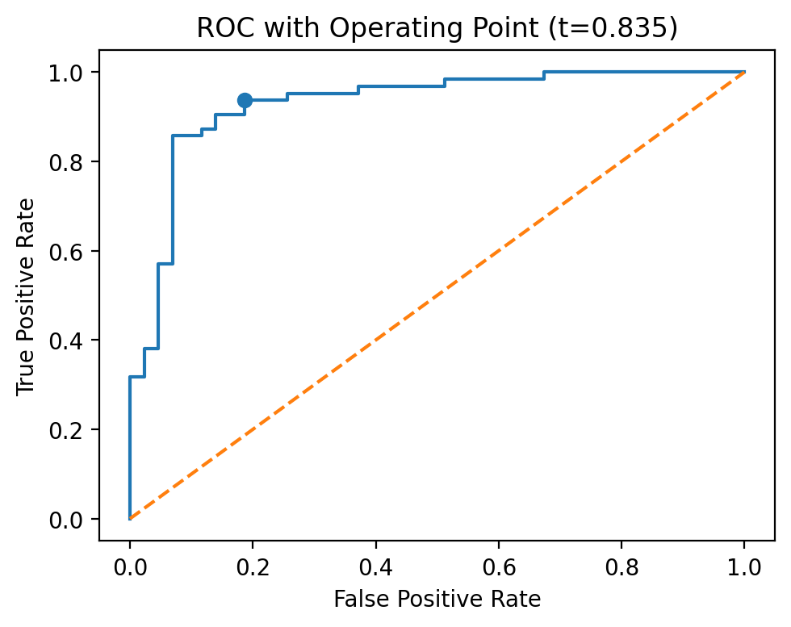
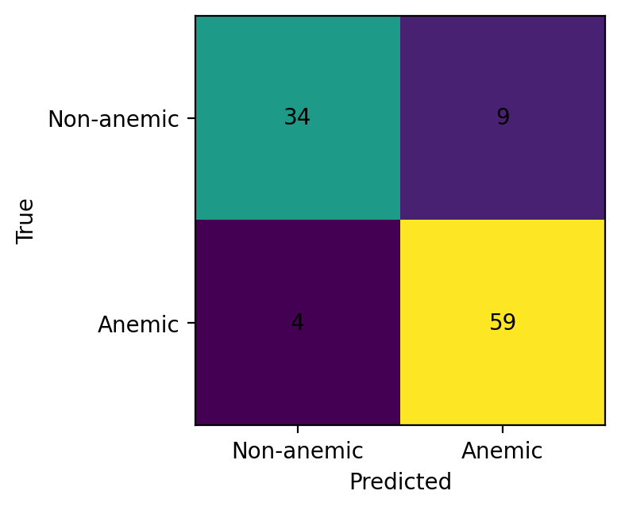
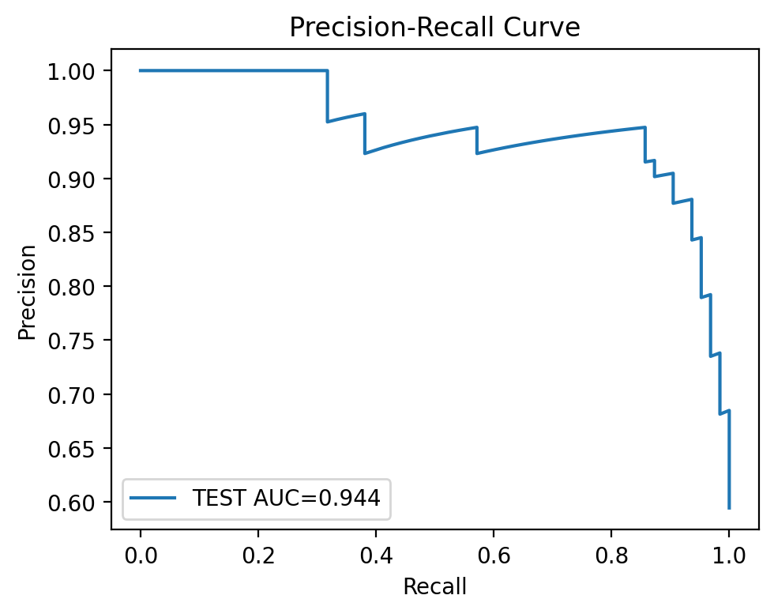
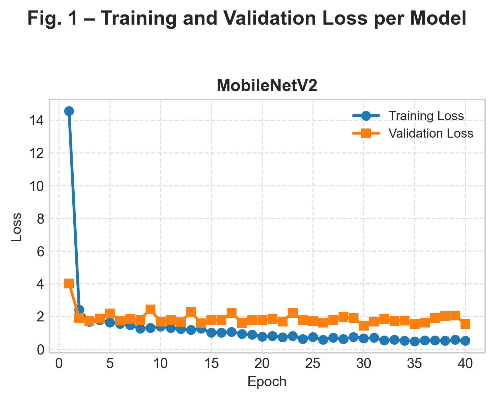
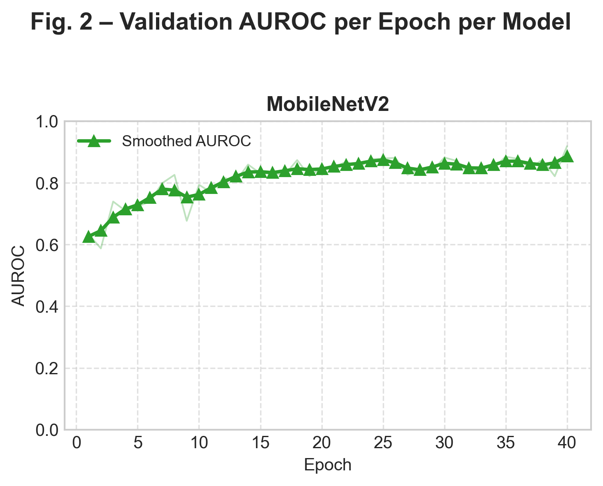
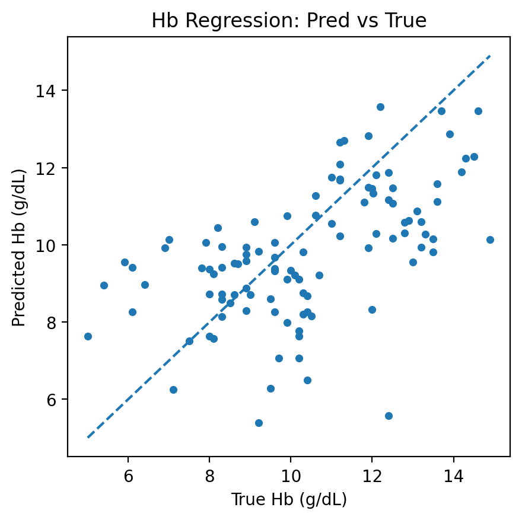
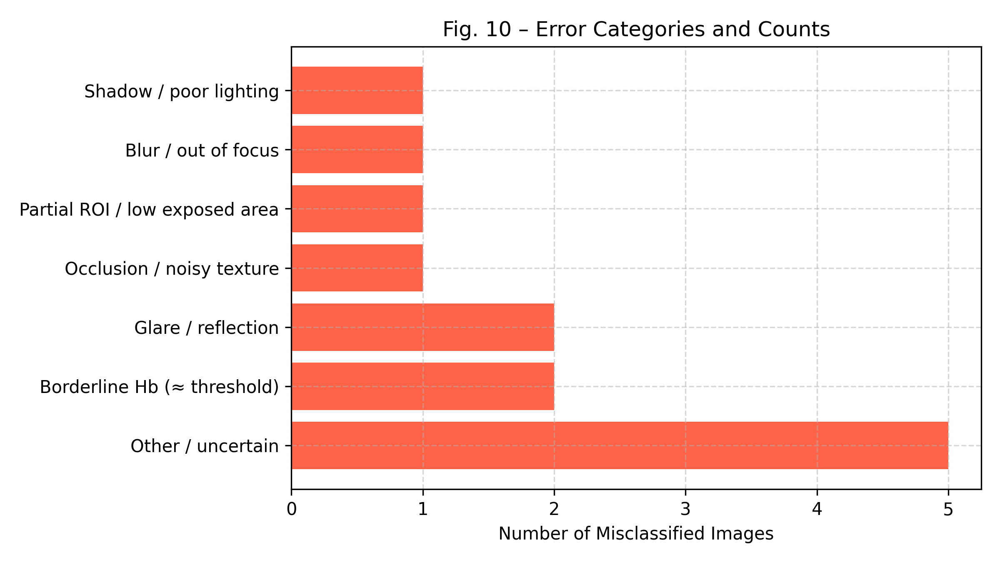

# A Lightweight Dual-Head MobileNetV2 Framework for Non-Invasive Anemia Detection and Hemoglobin Estimation

> Non-invasive anemia screening from conjunctival images using a multitask deep learning model — no blood test required.


---

## 📄 Abstract

Anemia affects over 2 billion people worldwide, yet clinical diagnosis requires laboratory blood testing — a barrier in low-resource and remote settings. This work presents a **lightweight dual-head MobileNetV2** framework for non-invasive anemia screening from **conjunctival (inner eyelid) images**, requiring only a smartphone camera.

The model jointly performs:
- 🔴 **Binary anemia classification** via a sigmoid output head (anemic / non-anemic)
- 📉 **Hemoglobin level regression** via a linear output head (Hb in g/dL) as an auxiliary multitask signal

The decision threshold is clinically tuned to **maximize sensitivity** — missing an anemic patient carries greater clinical risk than a false positive resolved by confirmatory testing. The lightweight MobileNetV2 backbone is designed for **mobile and low-resource deployment** without sacrificing diagnostic accuracy.

**Keywords:** anemia detection · conjunctival imaging · MobileNetV2 · hemoglobin regression · multi-task learning · telemedicine

---

## 🗂️ Dataset — CP-AnemiC

| Property | Details |
|---|---|
| Name | CP-AnemiC (Conjunctival Pallor Anemia Dataset) |
| Images | 710 pediatric conjunctival images |
| Labels | Lab-measured hemoglobin (Hb) values in g/dL |
| Anemia definition | WHO guideline: Hb < 10 g/dL |
| Capture device | Samsung Galaxy Tab 7A, standardized non-flash lighting |
| Split strategy | Subject-aware stratified split |
| Train / Val / Test | 496 / 107 / 107 images |
| Resolution | 320 × 320 pixels |

**Preprocessing pipeline:**
- HSV-based color masking and morphological smoothing to isolate the conjunctival region
- Center crop fallback when segmentation confidence is low
- Illumination normalization via gray-world white balance

> Images are **not included** in this repository to protect patient privacy.

---

## 📐 Model Architecture

**MTLMobileNetV2** — MobileNetV2 backbone (ImageNet pretrained) with two independent output heads:

```
Input Image (320×320)
       │
  MobileNetV2 Backbone (ImageNet pretrained)
       │
  Global Average Pooling
       ├──→ Classification Head → sigmoid → anemic / non-anemic
       └──→ Regression Head    → linear  → Hb (g/dL)
```

| Component | Detail |
|---|---|
| Backbone | MobileNetV2 (pretrained, ImageNet) |
| Classification loss | BCEWithLogitsLoss |
| Regression loss | MSELoss |
| Class imbalance | Weighted random sampling |
| Threshold tuning | 181 values swept (0.05–0.95), maximizes F1 on validation set |
| Best epoch | 40 / 50 |
| Optimal threshold | **0.835** |

---

## 📊 Results

### Classification — Test Set (n = 107, threshold = 0.835)

| Metric | Value |
|---|---|
| Accuracy | 87.7% |
| Precision | 86.8% |
| **Recall / Sensitivity** | **93.7%** |
| F1-Score | 90.1% |
| ROC-AUC | 92.9% |
| PR-AUC | 94.5% |

**Confusion Matrix** (threshold = 0.835, clinically tuned for sensitivity):

|  | Predicted Anemic | Predicted Non-Anemic |
|---|---|---|
| **Actually Anemic** | TP = 59 | FN = 4 |
| **Actually Non-Anemic** | FP = 9 | TN = 34 |

### Hemoglobin Regression — Auxiliary Head

| Metric | Value |
|---|---|
| MAE | 1.60 g/dL |
| RMSE | 2.01 g/dL |
| R² | 0.198 |
| Pearson r | 0.555 (p = 0.001) |

> The regression head serves as an auxiliary multitask signal to improve classification feature learning. It is **not intended as a standalone diagnostic tool** for precise Hb measurement.

### ROC Curve & Clinical Operating Point



### Confusion Matrix



### Precision-Recall Curve



### Training & Validation Loss



### Validation AUROC per Epoch



### Hemoglobin Scatter Plot (Predicted vs. True)



---

## 🔍 Error Analysis

Of 107 test images, **13 were misclassified** (4 FN, 9 FP). Error categorization reveals that most failures stem from **image acquisition quality**, not model limitations:



| Error Category | Count | % |
|---|---|---|
| Other / uncertain | 5 | 38% |
| Glare / reflection | 2 | 15% |
| Borderline Hb (~11.0 g/dL) | 2 | 15% |
| Shadow / poor lighting | 1 | 8% |
| Blur / out of focus | 1 | 8% |
| Partial ROI / low exposed area | 1 | 8% |
| Occlusion / noisy texture | 1 | 8% |

---

## ⚠️ Limitations

- **Small single-site dataset** (710 images) from a single pediatric cohort — generalizability to adult or multi-center populations is not established
- **Illumination variability** remains a challenge; glare and shadow account for ~23% of errors despite normalization
- **Regression head** provides ordinal Hb severity estimates (MAE ±1.60 g/dL) but is not suitable for precise clinical Hb measurement
- **Future work:** larger multi-center datasets, improved conjunctival segmentation, advanced illumination normalization, and cross-device validation

---

## 🗃️ Project Structure

```
anemia_project20/
├── results/                          # Key figures embedded in README (tracked)
│   ├── roc_with_op_test.png
│   ├── confusion_matrix_test_mobilenetv2.png
│   ├── pr_curve_test_mobilenetv2.png
│   ├── hb_scatter_test_mobilenetv2.png
│   ├── fig1_loss.png
│   ├── fig2_auroc.png
│   └── Fig10_Error_Categories.png
├── docs/
│   └── mbv2 REPORT.docx              # Full technical report
├── Anemic/                           # Patient images (not tracked — privacy)
├── Non-anemic/                       # Patient images (not tracked — privacy)
├── splits/                           # Train/val/test CSVs (not tracked)
├── exp/mobilenetv2_mtl_320/          # Model weights & predictions (not tracked)
├── make_splits.py                    # Step 1: create dataset splits
├── train_multitask_mobilenetv2.py    # Step 2: train MobileNetV2 MTL model
├── make_all_figures_and_report.py    # Step 3: generate evaluation figures & report
├── t_v_auroc.py                      # Plot training loss and AUROC curves
├── reliability_calibration.py        # Plot reliability / calibration diagram
├── error_analysis.py                 # Categorize misclassified images
├── error_samples.py                  # Count false positives / negatives
├── requirements.txt
└── .gitignore
```

---

## 🚀 Quickstart

```bash
git clone https://github.com/omarmehraby/-Dual-Head-MobileNetV2-Framework-for-Non-Invasive-Anemia-Detection-and-Hemoglobin-Estimation.git
cd -Dual-Head-MobileNetV2-Framework-for-Non-Invasive-Anemia-Detection-and-Hemoglobin-Estimation
pip install -r requirements.txt
```

### Step 1 — Create dataset splits

```bash
python make_splits.py --root /path/to/dataset
```

### Step 2 — Train the model

```bash
python train_multitask_mobilenetv2.py \
  --train_csv splits/train.csv \
  --val_csv   splits/val.csv \
  --test_csv  splits/test.csv \
  --outdir    exp/mobilenetv2_mtl_320
```

### Step 3 — Generate evaluation figures

```bash
python make_all_figures_and_report.py \
  --val_csv   exp/mobilenetv2_mtl_320/val_preds_mobilenetv2.csv \
  --test_csv  exp/mobilenetv2_mtl_320/test_preds_Mobilenetv2.csv \
  --metrics   exp/mobilenetv2_mtl_320/metrics.json \
  --threshold exp/mobilenetv2_mtl_320/tuned_threshold.json \
  --outdir    exp/mobilenetv2_mtl_320/figures
```

### Step 4 — Plot training curves

```bash
python t_v_auroc.py \
  --history_csv exp/mobilenetv2_mtl_320/history_mobilenetv2.csv \
  --outdir      exp/mobilenetv2_mtl_320
```

### Step 5 — Error analysis

```bash
python error_analysis.py --preds_csv exp/mobilenetv2_mtl_320/test_preds_MobilenetV2.csv
python error_samples.py  --preds_csv exp/mobilenetv2_mtl_320/test_preds_Mobilenetv2.csv
```

### Step 6 — Reliability diagram

```bash
python reliability_calibration.py \
  --bins_csv exp/mobilenetv2_mtl_320/figures/calibration_bins_test.csv \
  --outdir   exp/mobilenetv2_mtl_320/figures
```

---

## 📦 Dependencies

```bash
pip install -r requirements.txt
```

```
torch>=2.0.0
torchvision>=0.15.0
pillow>=9.0.0
opencv-python>=4.7.0
scikit-learn>=1.2.0
pandas>=1.5.0
numpy>=1.23.0
matplotlib>=3.6.0
scipy>=1.10.0
openpyxl>=3.1.0
```

---

## 📖 Citation

If you use this work, please cite:

```
Omar Mehraby, Bouali Et-taibi, Rania Abchir,
"A Lightweight Dual-Head MobileNetV2 Framework for Non-Invasive Anemia Detection
and Hemoglobin Estimation"
Accepted at ISIoT 2026 Conference
Al Akhawayn University in Ifrane (AUI), Morocco
```

**BibTeX:**

```bibtex
@inproceedings{mehraby2026anemia,
  author    = {Omar Mehraby and Bouali Et-taibi and Rania Abchir},
  title     = {A Lightweight Dual-Head MobileNetV2 Framework for Non-Invasive
               Anemia Detection and Hemoglobin Estimation},
  booktitle = {Proceedings of the International Symposium on the Internet of Things (ISIoT 2026)},
  year      = {2026},
  address   = {Al Akhawayn University in Ifrane (AUI), Morocco},
  note      = {Accepted}
}
```

---

## 🙏 Acknowledgements

- **Dataset:** CP-AnemiC — Appiahene et al., *Medicine in Novel Technology and Devices*, 2023
- **Backbone:** MobileNetV2 — Howard et al., *CVPR 2018*

---

## 🛠️ Tech Stack

`Python` · `PyTorch` · `torchvision` · `OpenCV` · `scikit-learn` · `pandas` · `matplotlib` · `scipy`
